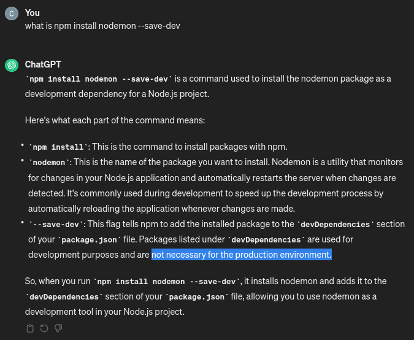
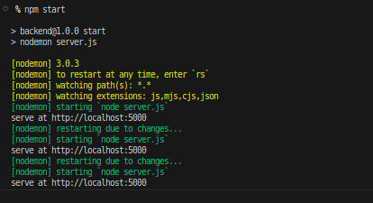

# How to create a node JS server

1. run npm init (initialize) in the root folder

What is `npm init` ?

npm init is a command used in Node.js to initialize a new Node.js project. When you run npm init in a directory, it prompts you with a series of questions, such as the project name, version, description, entry point file, author, license, etc. Based on your responses, it generates a package.json file in the directory.

The package.json file is a manifest file for Node.js projects, which includes metadata about the project, such as its name, version, dependencies, scripts, and other configurations. This file is essential for managing Node.js projects and is used by npm (Node Package Manager) to install dependencies, run scripts, and manage project configurations.

2. Nodemon

   - `npm install nodemon --save-dev`

3. run `npm start` instead of `node server.js`

   - nodemon server.js will run and it will listen to all changes in files in the backend folder
   - if there is any changes made in the server.js will will restart the server to apply the new changes every time

   

4. STATUS `304` vs STATUS `200`

   - 304: Not Modified, 200: OK

   - a 200 status code means that the server is sending the requested resource in the response, while a 304 status code means that the server is not sending the requested resource again because the client already has a current version of the resource in its `cache`.

   - to recognize the difference open the website link inside private tab and observed the 304 status only appears the second time the website is rendering meaning it shows the same resource it its cache
