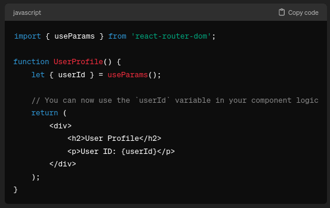
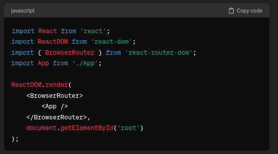
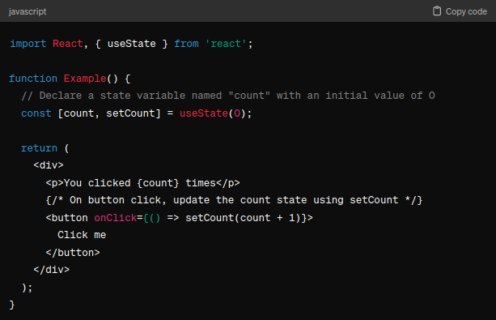
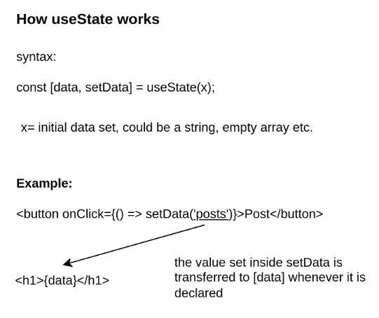
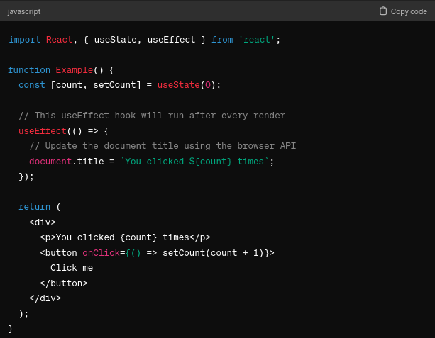
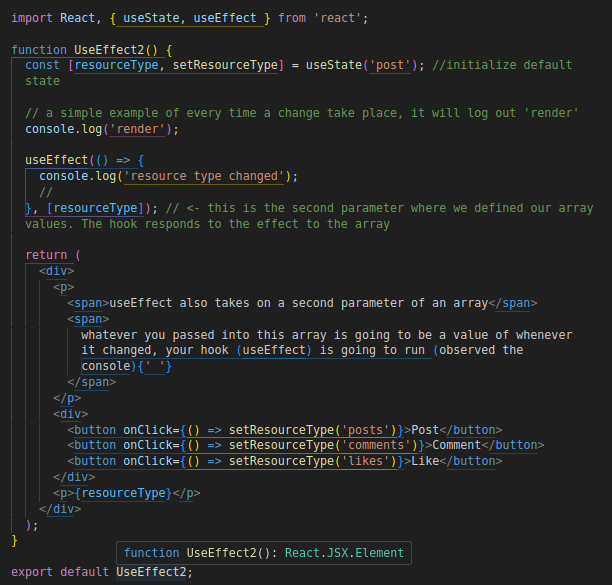
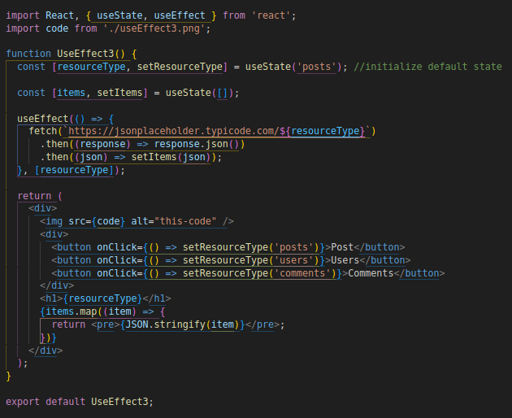

# React Components

## 1. useParams

"useParams" is a hook provided by React Router, which is a library for handling routing in React applications. 'useParams' is used specifically for accessing parameters from the URL in a React component.

How to use:

1. `import { useParams } from 'react-router-dom'`;

2. Using the Hook: You can call `useParams()` within a functional component to access the parameters from the URL

example of usage:

---

## 2. BrowserRouter

BrowserRouter is a component provided by React Router, a popular library used for handling routing in React applications. It is used to wrap the entire application and provide routing functionality to the components within it.

How to use:

1. Installation and Importing

   - `npm install react-router-dom` || `npm i react-router-dom`
   - `import { BrowserRouter } from 'react-router-dom';`

2. Wrapping the App: You wrap your entire application with the BrowserRouter component. Typically, this is done at the root level of your application, usually in the index.js or App.js file.

3. Routing: Once your application is wrapped with `BrowserRouter`, you can use various routing components and hooks provided by React Router, such as `Route`, `Switch`, `Link`, etc., to define and navigate between different views of your application. Import by adding,

   - `import { Route, Switch, Link } from 'react-router-dom';`

---

## 3. Link (link to) VS Anchor (a href)

- When building a single page application, use link instead of anchor to prevent the page from refreshing every time

- Link is a component from react-router-dom

How to use:

- Anchor: `<a href= "path"> Text </a>`
- Link: `<Link to= "path" > Text </Link>`

## 4. useState()

In React, useState() is a Hook that allows functional components to manage state. Before the introduction of Hooks in React, state management was only possible in class components using the setState() method. However, with the advent of Hooks, functional components can now have stateful logic.

useState() is a function provided by React that returns a stateful value and a function to update that value. The returned array from useState() always contains two elements: the current state value and a function to update that value.

How to use:

1. `import { useState } from 'react';`

2. example of usage:

How it works:

## 5. useEffect()

useEffect is another Hook in React that allows you to perform `side effects` in function components. Side effects may include data fetching, subscriptions, or manually changing the DOM in React components.

The Effect Hook lets you perform side effects in function components:

Example 1:

- 

Example 2:

- 

Example 3:

- 

## 6. useReducer()

useReducer is a hook provided by React that allows you to manage complex state logic in your components in a more structured way. It is an alternative to useState and is particularly useful when state transitions are more complex and involve multiple sub-values, or when the next state depends on the previous one.

Example 1:

- 

## 7. reducer logger package

useReducer logger package is a development end tool for checking the reducer dispatch status. To use the package, install

`npm install use-reducer-logger --force`

then in the codebase, implement the keyword logger by wrapping in the reducer function such as this

`const [state, dispatch] = useReducer(logger(reducer), initialState);`

and import the package by adding

`import logger from 'use-reducer-logger';`

## 8. helmet async

React Helmet Async is an asynchronous version of the React Helmet library. React Helmet is a popular library in the React ecosystem used for managing the <head> of your HTML document. It allows you to dynamically update meta tags, titles, styles, scripts, and other elements in the document head based on the state of your React components.

## 9. className = "visually-hidden"

The className="visually-hidden" attribute is typically used in HTML elements to visually hide the content from sighted users while keeping it accessible to screen readers and other assistive technologies.

This class name is used in the loading components to indicate the screen is loading
